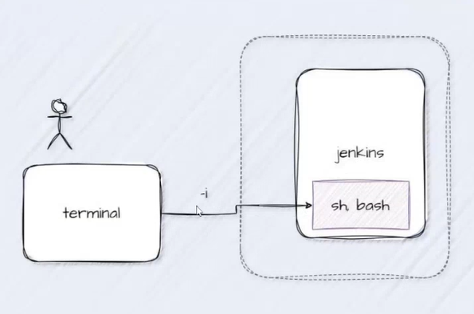
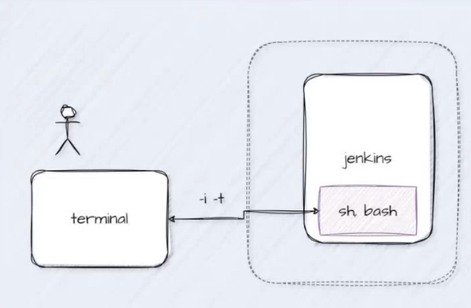

### Iniciando una sesión de shell dentro del contenedor de Docker

- `docker exec <nombre-contenedor> <programa o comando>`

Ej: `docker exec jenkins sh`

//Establecemos comunicacion pero nada mas (ni mandar ni recibir comandos)

### Para ejecutar un shell interactivo en un contenedor de Docker especificado

- `docker exec -i <nombre contenedor> <programa o comando>`
  
Ej: `docker exec -i jenkins2 sh`

//Podemos enviar comandos pero no podemos ver respuestas 

### Para ejecutar un shell interactica bidireccional en un contenedor de docker especificado

- `docker exec -it <nombre contenedor> <programa o comando>` //Sirve para ejecutar la shell en el terminal

Ej: `docker exec -it jenkins sh`

//Podemos enviar comandos y ver las respuestas (bidireccional)

en el terminal tenemos que poner:

`cat /var/jenkins_home/secrets/initialAdminPassword`
(cat sirve para ver el contenido del archivo)
de modo que extraigamos la contraseña para el inicio de sesión yendonos al localhost:8080

### Para ver los logs de un contenedor

- `docker logs <nombre contenedor>` //Nos devuelve las diferentes varialbes de entorno que podemos usar para realizar configuraciones
- Ej `docker logs mysql` 

### Para crear un contenedor con variables de entorno

- `docker run -d --name <nombre contendeor> -e <nombre variable>=valor -e <nombre variable>=valor <nombre imagen>:<tag>`

dependiendo de la imagen tenemos diferentes variables de entorno y usualmente estas variables estan asociadas a los usarios o contraseñas para tener acceso al servidor
