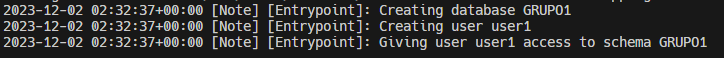

### Para crear un contenedor con MYSQL de manera correcta

- `docker run -d --name <nombre contenedor> -e MYSQL_ROOT_PASSWORD=<valor> mysql:8`

- Ej: `docker run -d --name mysql -e MYSQL_ROOT_PASSWORD=4498 mysql:8`

### Para crear un contenedorde MYSQL usuando variables de entorno desde un archivo plano

- `docker run -d --name <nombre contenedor> --env-file=nombreArchivo.txt <imagen>`

- Ej: `docker run -d --name mysql --env-file=variables.txt mysql:8`

Verificamos que se han tomado las variables creadas de entorno con: `docker logs mysql`

Si se se lee que se ha creado la BD y los usuarios entonces la creación del contenedor con las variables de entorno fue correcta.

Otra forma de verlo es ejecutando el terminal del contenedor con: `docker exec -it mysql sh`
una vez en el terminal podemos leer los ficheros con: `echo $MYSQL_USER`

### Cliente de MYSQL (PhPMyAdmin)
Se desea recrear esta imagen:

Para ello, primero creamos ambos contenedores y lo inicializamos con los puertos correspondientes:

- `docker run -d --name mi_contenedor -e VARIABLE_DE_ENTORNO=valor imagen:tag`

- `-d`: Ejecuta el contenedor en segundo plano (modo detached).
- `--name mi_contenedor`: Asigna un nombre al contenedor.
- `-e VARIABLE_DE_ENTORNO=valor`: Establece la variable de entorno VARIABLE_DE_ENTORNO con el valor valor dentro del contenedor.
- `imagen:tag`: Especifica la imagen de Docker que se utilizará para crear el contenedor.
  
- Ej: `docker run -d --name phpmyadmin -p 3000:80 -e PMA_ARBITRARY=1 phpmyadmin`

Una vez creado el contenedor phpmyadmin en el puerto host 3000 y con el puerto contenedor 80, debemos de conectarnos al contenedor mysql creada anteriormente.
Para ello entramos en la shell del phpmyadmin con el comando: `docker exec -it phpmyadmin sh`, por buenas practicas actualizamos los paquetes (dado que los contenedores son versiones ligeras de linux) con el comando `apt-get update`, para posteriormente realizar el ping al servidor mysql con el comando `ping mysql`, si aun no se instala el comando ping, probemos con: `apt-get install iputils-ping`

en caso de que `ping mysql` no reconoza el nombre, probaremos haciedo ping a la direccion IP `ping ` para saber la direccion IP podemos hacer un `docker inspect mysql` y corroborar el ping entre phpmyadmin y el mysql

## **Creamos un usuario en MySQL y creamos una BD**

### Creamos un usuario
Una vez comprobado todo que esté funcionando, procedemos a crear un usuario para mi BD, para ello escribimos el siguiente comando
`mysql -u user1 -p` donde: 

- `mysql`: Este es el comando para iniciar la interfaz de línea de comandos de MySQL.

- `-u user1`: Especifica el nombre de usuario que se utilizará para la conexión. En este caso, "user1".

- `-p`: Indica a MySQL que debe solicitar la contraseña después de ejecutar el comando. Después de presionar Enter, se te pedirá que ingreses la contraseña del usuario especificado.

creamos la contraseña, yo escribí la contraseña como 1234

### Creamos una BD
Como ya creamos una BD, tenemos que mostrar todas las BD creadas con el comando: 
`show databases`

