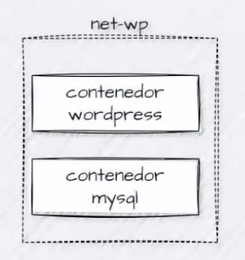

Se desea recrear esta imagen

### crear la red y vincular al contenedor mysql

Primero vinculamos el contenedor ya creado de mysql a la red
- `docker network create net-wp`
- `docker network connect net-wp mysql`

A continuación creamos el contenedor wordpress asignando el puerto host de 9300 y el puerto contenedo de 80 además usamos variables de entorno ya predefinidas en nuestro archivo para que se conecte al usuario ya creado
- `docker run -d --name server-wp -e WORDPRESS_DB_HOST=mysql-server -e WORDPRESS_DB_USER=user1 -e WORDPRESS_DB_PASSWORD=1234 -e WORDPRESS_DB_NAME=GRUPO1 --network net-wp --publish published=9300,target=80 wordpress`