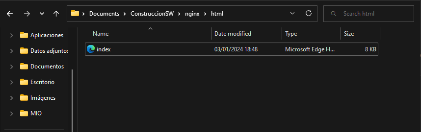

# 1.  **Volúmenes host**

### a.  *¿Qué sucede al ingresar al servidor de nginx?*

Al intentar ingresar al localhost se muestra el siguiente error:


Esto se debe a que la carpeta que se está intentado acceder se encuentra
vacía:


La sentencia usada para acceder al html desde mi host es la siguiente:


``` Batch
docker run -d \--name volumen_host \--publish 8080:80 -v C:\\Users\\garyc\\Documents\\ConstruccionSW\\nginx\\html:/usr/share/nginx/html nginx:alpine
  ```

### b.  *¿Qué pasa con el archivo index.html del contenedor?*

En pocas palabras resulta que en el host no hay ningún archivo con ese
nombre, entonces el sistema toma el archivo del contenedor y lo coloca
en el host, es por eso que el archivo \"index\" del contenedor reemplaza
al archivo \"index\" del host, ya que en el host no había ninguno.

### c. *¿Qué sucede al ingresar al servidor de nginx luego de cargar un template?*

Cargaremos el siguiente template en la ruta seleccionada:



Ahora al momento de refrescar la pagina "localhost:8080" vemos que el
index se carga correctamente:


### d.  *¿Qué sucede al eliminar el contenedor y crear nuevamente el mismo contenedor con volumen de tipo host a los directorios definidos anteriormente?*

Eliminamos el contenedor con la siguiente sentencia:

``` batch
docker rm -f volumen_host
```

Ahora volvemos a crear el contenedor con la misma ruta:

```batch
docker run -d \--name despuesDeEliminarlo \--publish 8080:80 -v C:\\Users\\garyc\\Documents\\ConstruccionSW\\nginx\\html:/usr/share/nginx/html nginx:alpine
```


Después de todo el proceso vemos que la página se despliega sin problemas, esto se debe que nosotros solo eliminamos el contenedor, sin embargo, la información que tiene el host no se eliminó y sigue alojada en nuestra computadora.

### e.  *¿Qué hace el comando pwd?*

Simplemente devuelve la ruta (path) en la que nos encontramos en el terminal


Al devolvernos la ruta en la que nos encontramos, la sentencia que escribimos al principio se puede abreviar de la siguiente forma para el puerto 8080

```
docker run -d \--name usandoPWD \--publish 8080:80 -v \${pwd}:/usr/share/nginx/html nginx:alpine
```
  


