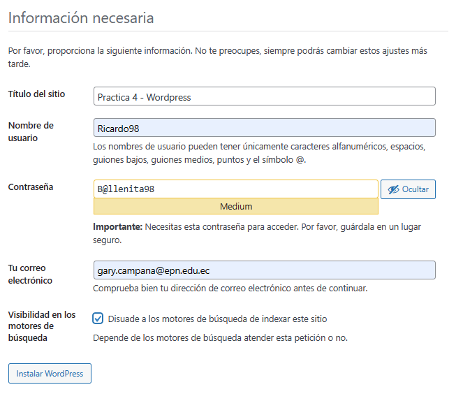
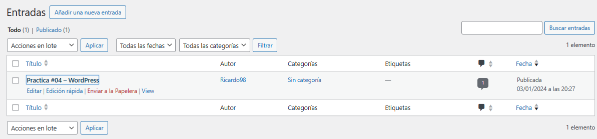
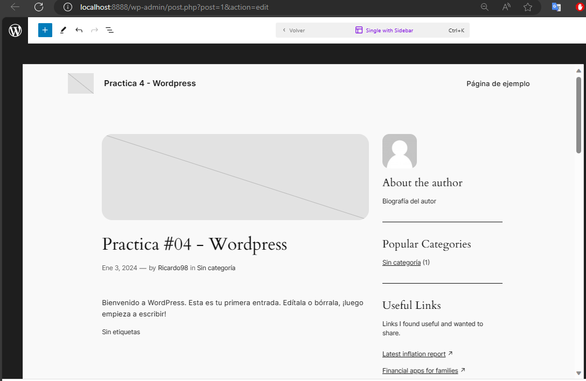
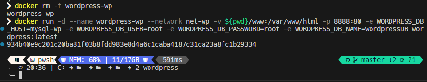
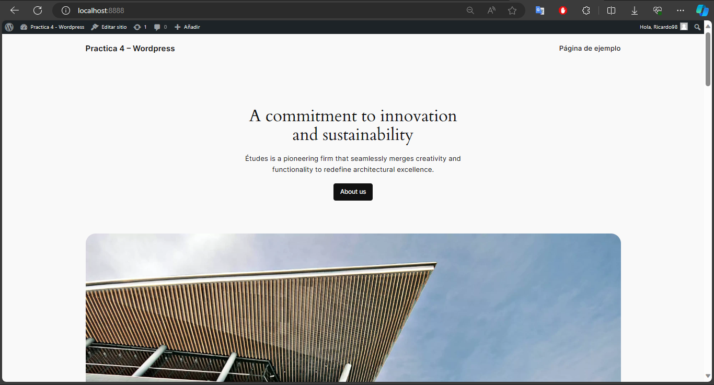

# 2.  **Wordpress**

### a.  *Crear una red net-wp*

```
docker network create net-wp
```

### b.  *¿En dónde mysql almacena la información?*

Para que persista la información es necesario conocer la ruta donde MySQL almacena la información.

MySQL como contenedor almacenan la información dentro del propio contenedor en el sistema de archivos del contenedor, en otras palabras y para ser más específicos los datos generalmente se encuentran en la ruta "/var/lib/mysql", específicamente en la carpeta de data.

Por otro lado, se nos pide crear la carpeta "db" en el host, por lo tanto, tenemos la siguiente sentencia:

```
docker run -d \--name mysql-wp \--network net-wp -v \${pwd}/db:/var/lib/mysql -e MYSQL_ROOT_PASSWORD=root -e MYSQL_DATABASE=wordpressDB mysql:latest
```
 
Donde "pwd" es la practica #04\> 2-wordpress

### c.  *¿En dónde wordpress almacena la información?*

Generalmente wordpress guarda la información en la ruta "/var/www/html"

### d.  *Crear contenedor de Wordpress en la red net-wp*

En el puerto 8888

```
docker run -d \--name wordpress-wp \--network net-wp -v \${pwd}/www:/var/www/html -p 8888:80 -e WORDPRESS_DB_HOST=mysql-wp -e WORDPRESS_DB_USER=root -e WORDPRESS_DB_PASSWORD=root -e WORDPRESS_DB_NAME=wordpressDB wordpress:latest
```

Una vez instalado el wordpress, acceder a la pagina a través del puerto
8888, y realizamos las correspondientes configuraciones



### e.  *Personalizar la apariencia de wordpress y agregar una entrada*





### f.  *Eliminar el contenedor y crearlo nuevamente, ¿qué ha sucedido?*



Lo eliminamos y volvemos a crear el contenedor, sin embargo, la
información se mantuvo y no se perdió:


