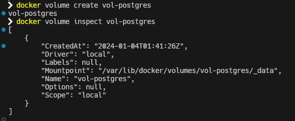

# 3.  **Volumen nombrado**


### a.  *Crear volumen*

```
docker volume create vol-postgres
```

### b.  *¿Cuál es el MountPoint de vol-postgres?*

Podemos observar los detalles del volumen con el comando

```
docker volume inspect vol-postgres
```

Podemos observar lo siguiente:



Donde el Mountpoint es *"/var/lib/docker/volumes/vol-postgres/\_data\"*

### c.  *Crear una red para postgres*

Para crear una red para postgres, basta con ingresar la siguiente sentencia:

```
docker network create net-postgres
```

### e.  *Sentencia para crear servidor postgres usando el volumen nombrado*

```
docker run -d \--name server-postgres \--network net-postgres postgres -e POSTGRES_DB=db_drupal -e POSTGRES_PASSWORD=12345 -e POSTGRES_USER=user_drupal -v vol-postgres:/var/lib/postgresql/data
```  

### f.  *¿Qué ha sucedido en vol-postgres?*

Cuando ejecutas la instrucción mencionada anteriormente, Docker vincula el volumen designado al punto de montaje del contenedor, logrando así persistencia. Incluso si se decide eliminar el contenedor, los datos almacenados en ese volumen perduran y no se pierden.